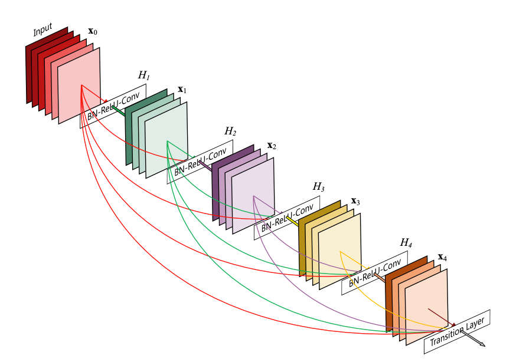

# Chest X-ray Analysis with Deep Learning

This project analyzes the NIH ChestX-ray8 dataset using deep learning techniques. The dataset, sourced from [Kaggle](https://www.kaggle.com/datasets/truptipillai/nih-chest-xray-dataset), contains chest X-ray images labeled for various medical conditions. The study details can be found in the [arXiv paper](https://arxiv.org/abs/1705.02315).

### 1. Data Exploration & Image Pre-Processing

Loading and preprocessing the chest X-ray dataset to familiarise with the data.

- **Code:** xray_image_pre-processing.py
- **Features:** 
    - Exploration of patient data and label distributions
    - Visualization of random images and their pixel intensity distributions
    - Image preprocessing using Keras ImageDataGenerator
    - Comparative analysis of raw and preprocessed images
- **Data:** 
    - `train-small.csv`
    - The images used in this project are stored in the `/images-small/` directory in PNG format.

### 2. Handling Class Imbalance with Weighted Loss Functions

Practicing the use of weighted loss functions to address class imbalance in a dataset.

- **Code:** xray_class_imbalance_weighted_loss.py
- **Features:** 
    - Calculation of class frequencies to determine weights
    - Implementation of weighted loss functions for binary and multi-class scenarios
    - Comparison of regular loss functions versus weighted loss functions
    - Visualization of class distribution in the training dataset
- **Data:** 
    - `train-small.csv`
   
### 3. Image Classification with DenseNet

Using a pre-trained DenseNet model for image classification to get familiar with DenseNet architecture.

- **Code:** densenet_image_classification.py
- **Features:** 
    - Utilization of a pre-trained DenseNet121 model
    - Exploration of the DenseNet architecture by printing summaries of the model's layers
    - Addition of a global average pooling layer and a dense layer for multi-label classification
    - Compilation of the final model with Adam optimizer and categorical crossentropy loss
    - Freezing of base model layers to prevent initial training
- **Data:** 
    - `densenet.hdf5` (Pre-trained model weights)
    
### 4. Handling Patient Overlap in Medical Data

Addressing patient overlap between training and validation datasets, which is a common issue related to data leakage in machine learning.

- **Code:** handle_data_leakage.py
- **Features:** 
    - Patient ID Extraction
    - Overlap Identification
    - Overlap Removal
    - Sanity Check
- **Data:** 
    - `train-small.csv`
    - `valid-small.csv` 
    
## DenseNet

Densenet is a convolutional network where each layer is connected to all other layers that are deeper in the network.

DenseNet Architecture:
The first layer is connected to the 3rd, 4th etc. The second layer is connected to the 3rd, 4th, 5th etc. Like this: 

For a detailed explanation of DenseNet, check out the source of the image above, a paper by Gao Huang et al. 2018 called [Densely Connected Convolutional Networks](https://arxiv.org/pdf/1608.06993).

For more detailed guidelines on data sampling and training, refer to `advanced_tips.md`.
