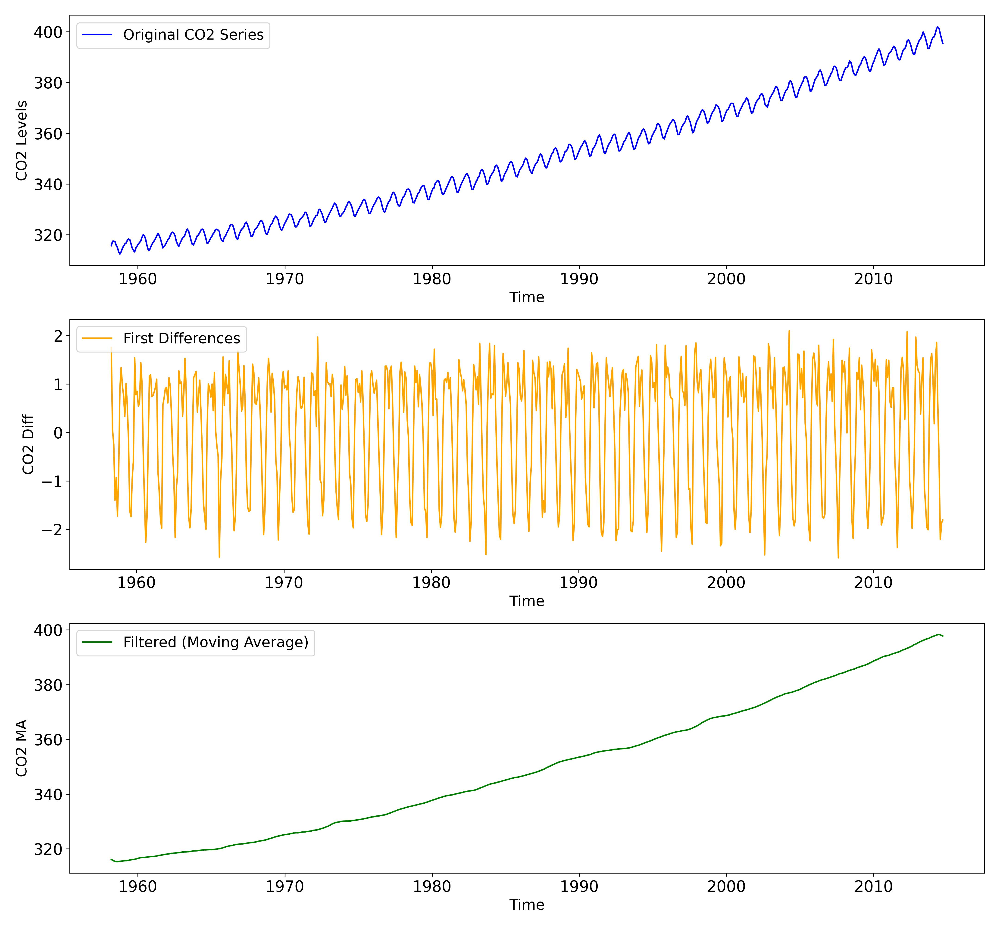

# CO2 Concentration Analysis: Differencing and Moving Average Filtering

This script performs time series analysis on CO2 concentration data from the 
Mauna Loa Observatory, Hawaii. It applies two key techniques—differencing and 
moving average filtering—to analyse and visualise trends and seasonality in CO2 levels.

## Techniques Used:
1. **First Differencing** (`co2_1stdiff`): 
   Removes the trend in the data by computing the difference between consecutive data points. 
   *Note: After differencing, the time series is reduced by one point.*
   
2. **Moving Average Smoothing** (`co2_ma`): 
   Filters out seasonality by applying a moving average with a window size of 12 months.

---
- **Code:** `co2_diff_ma.py`
- **Data:** 
    - `co2-atmospheric-mlo-monthly-scripps.xls`
- **Visualisations:**
    - **Original CO2 Series**: The raw CO2 data over time.
    - **First Differences**: Trend removal through differencing.
    - **Filtered CO2 Series**: Seasonality removal using moving averages.
    - 

