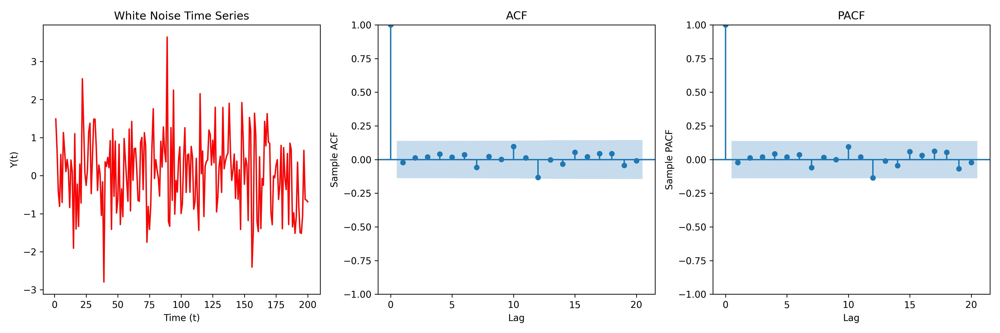

## 1. White Noise Simulation: Time Series, ACF, and PACF Analysis

This script simulates white noise and generates the following plots to analyze its properties:
1. **White Noise Time Series**: A sequence of random data points with a mean of zero and no temporal dependencies.
2. **Autocorrelation Function (ACF)**: Displays the correlation between the time series and its lagged values (i.e., how each point is related to previous points in time).
3. **Partial Autocorrelation Function (PACF)**: Shows the correlation between the time series and specific lagged values, controlling for intermediate lags.

White noise is crucial for understanding random behavior in time series data.

- **Code:** `01_white_noise_simulation.py`
- **Visualizations:**
    - **White Noise Time Series**: Random data with no temporal structure.
    - **ACF Plot**: Examines correlations between lagged values.
    - **PACF Plot**: Identifies direct lag dependencies.
    
    
    
- **Interpretation of Results**:
    - White noise is independent and identically distributed (i.i.d.): Each point in the series is completely independent of the others. As a result, both ACF and PACF behave similarly—both reveal no significant correlation beyond Lag 0.
    - In time series with structure (e.g., trends, seasonality, autoregressive patterns), ACF and PACF would differ. PACF isolates the direct relationships, while ACF reflects the combined effect of correlations across all lags.
    - In white noise, since each data point is independent, there is no pattern or trend over time, leading to similar results for both ACF and PACF.

---

## 2. AR(1) Process Simulation: Time Series, ACF, and PACF Analysis

This script simulates two AR(1) processes with different AR coefficients (high positive and high negative) and visualizes their time series, ACF, and PACF.

1. **For a positive AR(1) coefficient (phi > 0)**:
   - The ACF decays exponentially as a function of lag.
   - ACF values remain positive at all lags.
   - The PACF shows a strong coefficient at lag 1, with all coefficients for lags greater than 1 being approximately zero.

2. **For a negative AR(1) coefficient (phi < 0)**:
   - The ACF also decays exponentially as a function of lag.
   - The ACF oscillates between negative and positive values as it decays, reflecting the alternating behavior typical of processes with negative coefficients.
   - Similar to the positive phi case, the PACF shows a non-zero value at lag 1 and near-zero coefficients for all lags greater than 1.

- **Code:** `02_ar(1)_acf_pacf.py`
- **Visualizations:**
    - **Time Series for $\phi = 0.9$**: Demonstrates the behavior of a positive AR(1) process.
    - **Time Series for $\phi = -0.9$**: Illustrates the behavior of a negative AR(1) process.
    
    _pos_neg_phi.jpg)
    
    - **Theoretical ACF for $\phi = 0.9$**: Shows the true ACF values for the positive coefficient.
    - **Theoretical ACF for $\phi = -0.9$**: Displays the true ACF values for the negative coefficient.
    - **Sample ACF and PACF**: Visualizes the sample ACF and PACF for both processes.

    _acf_pacf.jpg)

- **Interpretation of Results**:
    - For **positive AR(1) processes**, the ACF is positive at all lags, indicating persistent correlation, while the PACF quickly drops off, showing the direct relationship is mainly at lag 1.
    - For **negative AR(1) processes**, the ACF oscillates, indicating an alternating pattern of correlation, and similar to the positive case, the PACF reflects a strong initial relationship at lag 1 followed by near-zero values.
    - These patterns highlight the distinct behaviors of AR(1) processes based on the sign of the coefficient.

---

## 3. Maximum Likelihood Estimation (MLE) for AR(1) Coefficient and Variance

This script computes the Maximum Likelihood Estimation (MLE) of the AR(1) coefficient ($\phi$) and 
variance ($v$) based on data simulated from an AR(1) process, using conditional likelihood. 
Additionally, it calculates the unbiased estimator for variance ($s^2$).

### Process:
1. **Data Simulation**: The AR(1) process is simulated with:
   - $\phi = 0.9$
   - $v = 1.0$ (innovation variance)
2. **MLE for AR(1) Coefficient**: The MLE for the AR(1) coefficient is calculated using 
the response vector and the design matrix.
3. **Variance Estimation**:
   - **Unbiased Estimator ($s^2$)**: Provides an unbiased estimate of the variance.
   - **MLE for Variance ($v$)**: The MLE for variance is computed using the sum of squared 
   residuals and the number of observations.

- **Code**: `03_mle_for_ar(1).py`
- **Key Results**:
    - **MLE of AR(1) coefficient ($\phi$)**: 0.8914
    - **MLE of variance ($v$)**: 0.9594
    - **Unbiased estimate of variance ($s^2$)**: 0.9613

### Interpretation:
- The estimated value of $\phi$ is close to the true value of 0.9, indicating that the MLE 
method accurately captures the dynamics of the AR(1) process.
- The small difference between $s^2$ and $v$ reflects the slight bias adjustment in the unbiased 
estimator compared to the MLE for variance. The unbiased estimator ($s^2$) tends to be slightly 
larger than the MLE ($v$), particularly in smaller samples. However, for large enough samples, 
this difference becomes negligible.

--- 
## 4. Maximum Likelihood Estimation (MLE) for AR(1) Coefficient Using ARIMA Function

- **Code**: `04_mle_for_ar(1)_arima.py`
---

## 5. Maximum Likelihood Estimation (MLE) for AR(1) Coefficient Using Full Likelihood

This script computes the MLE of the AR(1) coefficient ($\phi$) using the 
**full likelihood function** approach, which maximizes the joint likelihood 
of all observations in the time series.

### Process:

1. **Data Simulation**: 
   - The AR(1) process is simulated with:
     - $\phi = 0.9$ 
     - $v = 1.0$ (innovation variance)
     - 500 time points
   - The time series is generated using the AR(1) model: 
   $ y_t = \phi y_{t-1} + \epsilon_t $, where $\epsilon_t$ is white noise with variance $v$.

2. **Full Likelihood Estimation**:
   - The full likelihood is modeled based on the AR(1) structure, accounting for both the data points and the initial value.
   - A **log-likelihood function** is constructed, capturing the dependence of the time series on the AR coefficient.
   - **Numerical optimization** using the `minimize_scalar` method is applied to find the value of 
   $\phi$ that maximizes the likelihood function.

- **Code**: `05_mle_for_ar(1)_full_likelihood.py`
- **Key Results**:
    - **MLE of AR(1) coefficient ($\phi$)**: The estimated value of $\phi$ using full likelihood is approximately 0.8914.

### Interpretation:
- The MLE estimate for $\phi$ is close to the true value of 0.9, demonstrating that the full likelihood approach successfully captures the dynamics of the AR(1) process.
- By using the full likelihood, the method accounts for the entire time series, leading to a more precise estimation compared to methods based solely on conditional likelihood.

---
